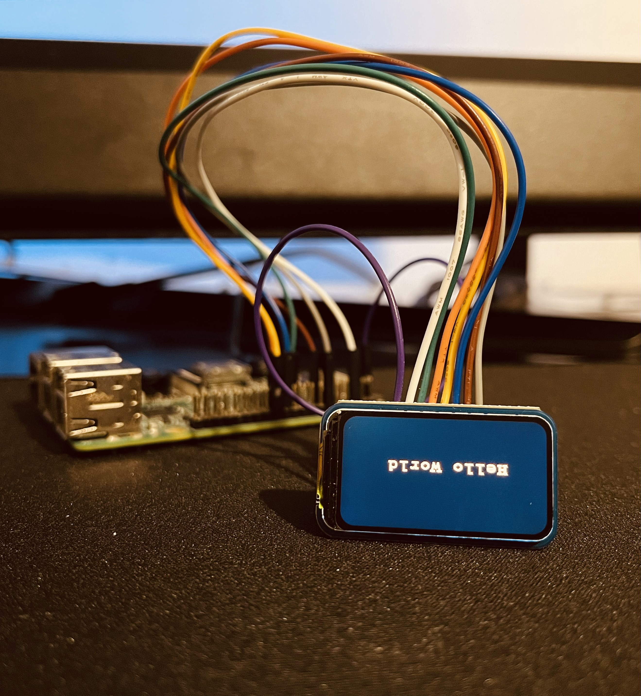

# LCD-Display

LCD Module ( 1.47" )


*Still trying to figure out how to reverse the output.*

## Hardware Overview
```
Working voltage         : 3.3V/5V
Communication interface : SPI
Screen Type             : IPS
Control chip            : ST7789V3
Resolution              : 172(H)RGB x 320(V)
Display size            : 17.39 x 32.35 mm
Pixel pitch             : 0.0337(H) x 0.1011(V) mm
Product size            : 22.0 × 38.5 mm
```

## Important Macros
### Dimensions
```
LCD_1IN47_WIDTH  172
LCD_1IN47_HEIGHT 320
```

### Colors
```
Color Name  RGB565  RGB888 (R, G, B)
WHITE       0xFFFF  255 , 255 , 255
BLACK       0x0000    0 ,   0 ,   0
BLUE        0x001F    0 ,   0 , 255
BRED        0xF81F  255 ,   0 , 255
GRED        0xFFE0  255 , 255 ,   0
GBLUE       0x07FF    0 , 255 , 255
RED         0xF800  255 ,   0 ,   0
MAGENTA     0xF81F  255 ,   0 , 255
GREEN       0x07E0    0 , 255 ,   0
CYAN        0x7FFF  127 , 255 , 255
YELLOW      0xFFE0  255 , 255 ,   0
BROWN       0xBC40  188 , 128 ,   0
BRRED       0xFC07  255 ,   0 ,  31
GRAY        0x8430  132 , 132 , 132
```
